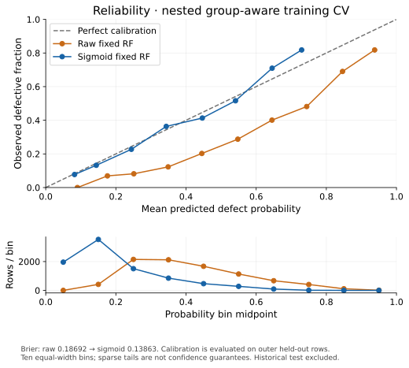

# When Better Models Are Not Enough: What to Do When Data Quality Becomes the Bottleneck

An ML project can keep improving its implementation while making little progress on its actual decision problem. DefectRisk reached that point. Stronger tree models, feature engineering and a small ensemble did not produce a material improvement over a carefully evaluated weighted Random Forest. The most useful next step was to examine what the data could tell us—and what confidence the product could honestly claim.

DefectRisk uses JM1: 21 static code metrics, recorded defect labels and 10,885 modules. The product objective is review prioritization. If a team can inspect roughly 30% of modules, which ranking brings the most recorded defects into that queue? “Caught” here means flagged modules with known defective labels, not evidence that an actual review process discovered every bug.

## Before improving a model, check what the evaluation measures

About 19.35% of the modules are defective. An always-clean rule would achieve roughly 80.65% accuracy and detect no defects. That arithmetic makes accuracy a weak primary metric for this product. Precision, recall, missed defects and review effort make the operational cost clearer.

The initial duplicate audit found a more fundamental problem. A random train/test split shared 299 complete feature vectors; a fit/validation split shared 227. The dataset had 2,061 duplicate feature rows beyond the first occurrence. A model could encounter the same static vector during fitting and evaluation. A convincing metric would then partly reflect repeated information.

The fix was to group complete original feature vectors before splitting. Labels were excluded from group identity. Every identical vector stayed on one side of train/test, fit/validation and CV boundaries, including groups with contradictory labels. Duplicates were retained, and an independent overlap audit checked each boundary before fitting.

This is why leakage prevention belongs before model comparison. A better-looking algorithm on a contaminated split does not answer the intended generalization question. A high reported number is credible only when its denominator, target definition, evaluation population and information boundaries are credible.

## Imbalance and operating policy are different problems

The Logistic Regression baseline's defective recall was low. Class weighting raised mean recall to about 53.65%, with precision around 34.75%. The cost was more clean modules entering the review queue. This was a useful trade-off to measure, not a reason to celebrate one metric in isolation.

Threshold analysis then reused the same held-out probabilities across cutoffs. Lower thresholds increased detection but also false positives. They did not create new information. Default Random Forest had relatively high accuracy and poor defective recall at threshold 0.50; that did not automatically make its ranking useless.

The comparison therefore moved to approximately equal review budgets. Model and policy were kept separate: a model estimates/ranks risk, while a deterministic capacity policy chooses how much can be reviewed. Selecting a threshold to achieve a score-only budget is different from tuning the model against evaluation labels.

## Stronger algorithms helped a little, then plateaued

Tree tuning used five group-aware outer folds for estimation and three inner folds for limited deterministic parameter selection. Class weights were learned from fitting labels only; preprocessing was fitted inside each fold. At approximately 30% review, balanced LR caught 906/1,685 known training defects, tuned weighted RF caught 953, tuned HGB caught 945, and the limited XGBoost search caught 926.

RF's 47 extra detections over LR were meaningful enough to keep it as the reference candidate. XGBoost did not beat that reference. The test for material improvement had been made explicit: at least two absolute recall points or 30 additional detections at similar workload, without clearly worse Average Precision. A tiny favorable number was not enough.

Interpretable engineering—complexity/branch density, line ratios, operator/operand ratios and fitted log transforms—did not materially improve the original-feature RF. Pruning added one detection. RF/HGB averaging added seven: recall moved from 56.56% to 56.97%. Those changes were smaller than the predefined product improvement requirement. Model exploration stopped.

This is evidence of diminishing returns, not a theorem that static metrics have reached their maximum possible score. Limited searches cannot rule out every other configuration. Repeated training-data exploration also leaves selection uncertainty. But endlessly searching the same representation was no longer the most defensible investment.

## Conflicting labels expose information limits without explaining all errors

The earlier full-data audit found 88 duplicate-vector groups with conflicting labels. The training-only study found 11 such groups containing 22 rows. These counts describe different populations.

When two modules have exactly the same measured features but different labels, a deterministic feature-only classifier cannot individually distinguish them. This could reflect omitted context, label ambiguity, snapshot mismatch or errors; contradictory observed labels do not establish which explanation is correct.

The training conflicts imply a minimum of 11 deterministic row classification errors, much less than the hundreds of missed defects. Exact conflicts are an important diagnostic, but attributing all model weakness to “label noise” would go beyond the evidence. Static size/complexity metrics also omit change history, previous defects, ownership, test coverage and review context. Formula inconsistencies and uncertain metric/label snapshot timing require provenance checks.

## Calibration improves meaning, not certainty

Weighted training changes a classifier's objective. Its raw score should not automatically be interpreted as a natural-frequency probability. DefectRisk compared raw RF, sigmoid and isotonic calibration using nested group-aware training-only evidence. Calibration maps fitted held-out RF scores, never their evaluation labels or the forest's in-sample predictions.

Sigmoid won every inner comparison. Pooled Brier score fell from about 0.18692 to 0.13863; Average Precision remained roughly stable. Reliability bins showed raw scores overstating observed defect frequencies and sigmoid bringing populated bins closer to the diagonal. Brier is a probability-quality score combining calibration, discrimination and uncertainty; the reliability curve and bin support are therefore part of the evidence, not decorative extras.

A calibrated probability is still a population-based estimate. It does not establish certainty about one module, causality, safety under distribution shift or knowledge of unmeasured context. Sparse tails are particularly fragile. A probability threshold of 0.50 also has a different operational meaning after calibration, even when a positive-slope calibration map preserves a fitted model's ranking.

## Why “90%+” can be an empty promise

The uncertainty study asked whether HIGH-risk predictions could achieve at least 90% precision with useful coverage. A post-hoc sigmoid tail selected four defective rows and showed 100% precision. Four observations, chosen after examining their evaluation outcomes, are not evidence for a broad high-confidence product.

A supported policy required at least 50 rows across 20 feature groups, choosing its cutoffs only within outer training. No usable HIGH tail qualified. Conservative automation classified 136 rows LOW and none HIGH, leaving 98.44% UNCERTAIN. Seven LOW cases were actually defective. Thresholds 0.90 and 0.95 produced no HIGH predictions; their precision was undefined, not perfect.

This is how a superficially impressive metric becomes misleading: hide tiny coverage, ignore undefined cases, or choose the winning cutoff on the same outcomes used to report it. Precision, recall, coverage, support and evaluation design must travel together.

Abstention is useful when it makes the model's limits visible rather than forcing unsupported binary decisions. But near-total abstention is not useful automation. Nor is uncertainty percentage automatically the full review workload: HIGH cases can also require inspection. The practical answer was calibrated risk ranking with human review, not an automatic defect oracle.

## Know when to stop tuning—and what to collect next

A credible stopping decision looks for repeated controlled plateaus, small product gains, weak or redundant feature associations, uncertain label provenance and poor confidence/coverage trade-offs. None proves an absolute information ceiling; together they can make a better-data investment more reasonable than another algorithm.

For software risk, genuinely new information includes code churn, commit history, previous defects, ownership, change frequency, test coverage and review history. Every feature needs a prediction-time definition, and labels need an explicit horizon and matching code snapshot. Histories recorded after the outcome must not leak into a supposed pre-release prediction.

The frozen raw RF's historical once-only holdout captured 300/421 known defects while reviewing 652/2,177 modules: 71.26% recall at 29.95% review. That positive result belongs to the historical frozen model; it is not independent validation of the later calibrated/abstaining system. The historical test was not reused to design calibration or policies. The new system requires a new independent external holdout, evaluated once after its settings are frozen.

The portfolio result is an engineering case, not a universal claim about defect prediction: honest boundaries, controlled comparisons, reproducible artifacts, explicit uncertainty and a product claim matched to available evidence. **DefectRisk predicts risk and ranking, not certainty.** Better data may matter more than more complex models when the current representation has stopped providing material gains.

Source evidence: [model card](model-card.md), [case study](portfolio-case.md), [duplicate audit](duplicate-audit.md), [nested tuning](tree-model-tuning.md), [feature engineering](feature-engineering.md), [ensemble ranking](ensemble-ranking.md), and [calibration/uncertainty](calibration-and-uncertainty.md). Numerical claims are specific to JM1 and this evaluation protocol.
