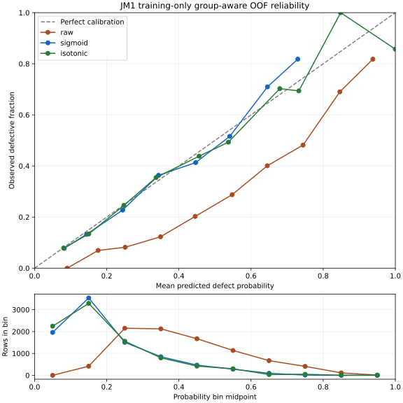

# Calibration and uncertainty: training-only RF study

The tuned weighted Random Forest remains the selected classifier. **Sigmoid calibration is recommended from training/CV evidence; useful 90%-precision HIGH automation is not supported.** Calibration improves probability reliability, not the amount of information in the static metrics. No production policy or historical frozen model was replaced.

## Data, frozen model and evaluation boundaries

Only the existing M3 training partition was passed into this study: **8,708 rows, 1,685 defective, 7,023 clean**, all 21 original features including `b`. Duplicates, missing values and conflicting labels were retained. The existing split routine reconstructs M3 and immediately discards its test outputs; no historical test object or final-evaluation artifact is inspected, fitted, predicted, or scored.

The unchanged base pipeline is median imputation → StandardScaler → RandomForestClassifier. The classifier settings are `n_estimators=200`, `max_depth=8`, `min_samples_leaf=3`, `max_features="sqrt"`, `class_weight="balanced_subsample"`, `random_state=42`, with all other settings at their existing defaults. [Every parameter is recorded](calibration-and-uncertainty-results/model-parameters.json). Preprocessing and RF fitting occur within each respective training fold. Calibration is unweighted so that its probabilities reflect the natural training prevalence rather than balanced class weights.

The exact trusted five outer StratifiedGroupKFold splits use `shuffle=True, random_state=42`. Groups use complete **original feature vectors only**, with matching missing values equal; target labels never enter groups. Three inner selection folds compare calibration methods and select policies. Inside each inner training partition, another three group-aware folds generate held-out raw RF scores to fit calibration maps. One unchanged RF is then fitted on that inner training partition and predicts its untouched inner validation rows. Calibration maps never fit on their evaluation labels or in-sample RF scores.

For each outer fold, inner OOF Brier score chooses raw, sigmoid or isotonic. Its confidence policy also uses only inner OOF scores/labels. Maps for outer evaluation are fitted on three-fold OOF scores within the entire outer training partition, with one RF refitted there before predicting outer validation. This is the single-model OOF calibration pattern, **not a classifier ensemble**. All three methods share the same base predictions in each evaluation block. The procedure made 80 unchanged RF fits.

**All 80 audited boundaries have exactly zero shared original feature vectors**, zero matching rows and zero matching row pairs. These comprise 5 outer, 15 selection and 60 calibration boundaries. Every training row receives one outer held-out prediction. [Exact audit](calibration-and-uncertainty-results/audits.csv), [OOF predictions](calibration-and-uncertainty-results/oof-probabilities.csv), and [manifest](calibration-and-uncertainty-results/manifest.json) are retained.

## Calibration choices and results

Raw probabilities are the identity map. Sigmoid is an unpenalized logistic map of the scalar raw probability (Platt-style, without sklearn's smoothed-target implementation). Isotonic is a nondecreasing piecewise map clipped outside observed support. Isotonic eligibility was prespecified as at least 1,000 calibration rows and original-feature groups, 100 examples of each label, and 20 distinct raw scores. All 20 calibration blocks qualified: calibration samples ranged from 4,643 to 6,967 rows, 4,435–6,655 groups, and 898–1,348 defects. This support makes the comparison reasonable; it does not validate sparse tail predictions.

Calibration requires held-out scores; isotonic can overfit with small support. Brier score measures probability quality but combines calibration, discrimination and outcome uncertainty, so the reliability curve is also necessary. [Scikit-learn calibration documentation](https://scikit-learn.org/stable/modules/calibration.html).

Pooled outer OOF results (`true` is defective; 0.50 here is a descriptive classification threshold):

| Probability | Brier ↓ | Average Precision | Precision at 0.50 | Recall at 0.50 | Flagged at 0.50 |
| --- | --- | --- | --- | --- | --- |
| raw | 0.186922 | 0.407035 | 37.59% | 52.23% | 26.88% |
| sigmoid | 0.138626 | 0.406185 | 57.14% | 13.06% | 4.42% |
| isotonic | 0.138884 | 0.399230 | 54.80% | 12.88% | 4.55% |

Unweighted five-fold means and population SD (`ddof=0`):

| Method | Brier mean ± SD | AP mean ± SD | Precision mean ± SD (0.50) | Recall mean ± SD (0.50) |
| --- | --- | --- | --- | --- |
| raw | 0.186921 ± 0.002540 | 0.409899 ± 0.022996 | 0.375416 ± 0.017222 | 0.522255 ± 0.041965 |
| sigmoid | 0.138626 ± 0.002495 | 0.409899 ± 0.022996 | 0.577604 ± 0.053628 | 0.130564 ± 0.015814 |
| isotonic | 0.138884 ± 0.002432 | 0.389559 ± 0.021768 | 0.584758 ± 0.088740 | 0.128783 ± 0.045454 |

Per-fold results:

| Fold | Method | Brier | AP | Precision (0.50) | Recall (0.50) |
| --- | --- | --- | --- | --- | --- |
| 1 | raw | 0.190272 | 0.396071 | 37.58% | 54.30% |
| 1 | sigmoid | 0.139760 | 0.396071 | 50.00% | 13.65% |
| 1 | isotonic | 0.139914 | 0.378201 | 48.12% | 18.99% |
| 2 | raw | 0.183742 | 0.450564 | 40.08% | 57.57% |
| 2 | sigmoid | 0.134240 | 0.450564 | 66.20% | 13.95% |
| 2 | isotonic | 0.134734 | 0.428838 | 64.38% | 13.95% |
| 3 | raw | 0.184960 | 0.417901 | 38.38% | 51.93% |
| 3 | sigmoid | 0.137860 | 0.417901 | 59.70% | 11.87% |
| 3 | isotonic | 0.137924 | 0.394705 | 71.88% | 6.82% |
| 4 | raw | 0.189472 | 0.400490 | 36.80% | 52.52% |
| 4 | sigmoid | 0.139644 | 0.400490 | 54.84% | 15.13% |
| 4 | isotonic | 0.139913 | 0.380906 | 50.00% | 16.02% |
| 5 | raw | 0.186161 | 0.384469 | 34.87% | 44.81% |
| 5 | sigmoid | 0.141624 | 0.384469 | 58.06% | 10.68% |
| 5 | isotonic | 0.141935 | 0.365146 | 58.00% | 8.61% |

**Sigmoid was selected in all five inner comparisons.** Thus the nested inner-selected OOF system equals the sigmoid column. Pooled Brier improved by 0.048296 (25.84%). Isotonic was slightly worse on Brier and AP and created sparse high-probability steps. We recommend sigmoid rather than extra isotonic flexibility. Calibration does not create a new defect-ranking breakthrough.

At comparable review budgets (cutoff chosen from probabilities only; tied scores stay together):

| Probability | Review % | Precision | Recall | Caught | Missed |
| --- | --- | --- | --- | --- | --- |
| raw | 30.00% | 35.95% | 55.73% | 939 | 746 |
| sigmoid | 30.00% | 36.06% | 55.91% | 942 | 743 |
| isotonic | 30.25% | 35.69% | 55.79% | 940 | 745 |

A fold-specific positive-slope sigmoid preserves ranking *within that fold*. Different maps can slightly reorder pooled cross-fold scores; isotonic additionally creates ties. These small pooled differences are not evidence of new information. The prior 56.56% recall / 953 defects benchmark estimated a nested RF hyperparameter-selection procedure; this study evaluates the **single already-selected fixed RF**, yielding 939 raw / 942 sigmoid detections, rather than repeating RF tuning.

Raw weighted-RF probabilities systematically overstate natural defect rates. For example, raw mean 0.5476 corresponds to observed 0.2876. Sigmoid brings most populated bins much closer to the diagonal. The highest sigmoid bin contains only 11 rows. Empty bins are omitted from curve lines; connected points do not imply reliable interpolation or confidence bounds.

| Sigmoid interval | Rows | Mean probability | Observed defect rate |
| --- | --- | --- | --- |
| [0.0, 0.1) | 1961 | 0.0822 | 0.0775 |
| [0.1, 0.2) | 3537 | 0.1440 | 0.1323 |
| [0.2, 0.3) | 1508 | 0.2441 | 0.2275 |
| [0.3, 0.4) | 850 | 0.3436 | 0.3635 |
| [0.4, 0.5) | 467 | 0.4465 | 0.4133 |
| [0.5, 0.6) | 281 | 0.5411 | 0.5160 |
| [0.6, 0.7) | 93 | 0.6455 | 0.7097 |
| [0.7, 0.8) | 11 | 0.7297 | 0.8182 |
| [0.8, 0.9) | 0 | — | — |
| [0.9, 1.0] | 0 | — | — |

[All raw/sigmoid/isotonic bin counts and frequencies](calibration-and-uncertainty-results/reliability-bins.csv). Average Precision is the reported threshold-independent PR summary; it is not trapezoidal PR-AUC.

## Abstention policies and evidence

A policy calls `p <= low` LOW, `p >= high` HIGH, and everything else UNCERTAIN. Boundaries are inclusive, must not overlap, and either automatic outcome may be disabled. HIGH precision = HIGH defects / HIGH rows. HIGH recall = HIGH defects / **all** defects, including UNCERTAIN defects. LOW false negatives count real defects automatically classified LOW. Auto error = (LOW false negatives + clean HIGH predictions) / all automatically classified rows. Empty HIGH precision and empty auto error are **undefined**, shown as —, never treated as perfect precision.

### Nested policy selection: honest outer estimate

The training-only policy selector maximizes supported HIGH coverage with empirical precision ≥90%, and LOW coverage with ≤5% observed defects. Each automatic tail must contain at least **50 rows from 20 distinct original-feature groups**. These are support screens, not statistical guarantees. Selection is applied to outer-fit inner OOF evidence before outer validation is seen.

| Outer fold | LOW ≤ | HIGH ≥ | LOW rows | UNCERTAIN | Coverage | LOW false negatives | Auto error |
| --- | --- | --- | --- | --- | --- | --- | --- |
| 1 | disabled | disabled | 0 | 1742 | 0.00% | 0 | — |
| 2 | 0.070609 | disabled | 44 | 1697 | 2.53% | 2 | 4.55% |
| 3 | disabled | disabled | 0 | 1741 | 0.00% | 0 | — |
| 4 | 0.060495 | disabled | 34 | 1709 | 1.95% | 1 | 2.94% |
| 5 | 0.071279 | disabled | 58 | 1683 | 3.33% | 4 | 6.90% |

Pooled: **136 LOW, 0 HIGH, 8,572 UNCERTAIN; 1.56% automatic coverage / 98.44% uncertainty**. LOW cases contain **7 defects**: 5.15% LOW defect rate and auto error. HIGH precision is undefined and HIGH recall is 0%. The inner ≤5% LOW constraint was not fully sustained in held-out outer evidence (fold 5 has 6.90% LOW defect rate); an empirical cutoff is not a guarantee. Two folds disabled LOW as well because no tail met support and risk constraints.

### Prespecified fixed policies: exploratory OOF trade-offs

The 16 thresholds below were fixed as an analysis grid. Predictions are outer-held-out, but choosing a favorite row after inspecting this pooled table does **not** give an independently validated policy. Thresholds were not chosen from the historical final test.

| LOW ≤ | HIGH ≥ | Auto coverage | UNCERTAIN/review | HIGH precision | HIGH recall | HIGH rows | LOW false negatives | Auto error |
| --- | --- | --- | --- | --- | --- | --- | --- | --- |
| 0.05 | 0.50 | 4.48% | 95.52% | 57.14% | 13.06% | 385 | 0 | 42.31% |
| 0.05 | 0.70 | 0.18% | 99.82% | 81.82% | 0.53% | 11 | 0 | 12.50% |
| 0.05 | 0.90 | 0.06% | 99.94% | — | 0.00% | 0 | 0 | 0.00% |
| 0.05 | 0.95 | 0.06% | 99.94% | — | 0.00% | 0 | 0 | 0.00% |
| 0.10 | 0.50 | 26.94% | 73.06% | 57.14% | 13.06% | 385 | 152 | 13.51% |
| 0.10 | 0.70 | 22.65% | 77.35% | 81.82% | 0.53% | 11 | 152 | 7.81% |
| 0.10 | 0.90 | 22.52% | 77.48% | — | 0.00% | 0 | 152 | 7.75% |
| 0.10 | 0.95 | 22.52% | 77.48% | — | 0.00% | 0 | 152 | 7.75% |
| 0.15 | 0.50 | 51.45% | 48.55% | 57.14% | 13.06% | 385 | 373 | 12.01% |
| 0.15 | 0.70 | 47.15% | 52.85% | 81.82% | 0.53% | 11 | 373 | 9.13% |
| 0.15 | 0.90 | 47.03% | 52.97% | — | 0.00% | 0 | 373 | 9.11% |
| 0.15 | 0.95 | 47.03% | 52.97% | — | 0.00% | 0 | 373 | 9.11% |
| 0.20 | 0.50 | 67.56% | 32.44% | 57.14% | 13.06% | 385 | 620 | 13.34% |
| 0.20 | 0.70 | 63.26% | 36.74% | 81.82% | 0.53% | 11 | 620 | 11.29% |
| 0.20 | 0.90 | 63.14% | 36.86% | — | 0.00% | 0 | 620 | 11.28% |
| 0.20 | 0.95 | 63.14% | 36.86% | — | 0.00% | 0 | 620 | 11.28% |

UNCERTAIN/review is the abstention fraction. HIGH also recommends targeted inspection, so if every HIGH and UNCERTAIN case needs human attention, total review workload is **100% minus LOW coverage**, not just the UNCERTAIN column. For low=0.10 this is 77.48%; low=0.15 gives 52.97%; low=0.20 gives 36.86%, at the cost of 620 defects automatically labeled LOW. Auto coverage must not be mistaken for defects detected.

## Answers and practical recommendation

1. **Can HIGH reach ≥90% precision?** No adequately supported or nested-validated HIGH tail did. A post-hoc outer-OOF threshold of 0.745969 happens to select 4 rows in 4 groups, all defective (100% precision), but this is only 0.046% HIGH coverage and 0.237% defect recall. It was selected by looking at those very evaluation outcomes and is not a trustworthy 90% precision claim. At a prespecified 0.70 threshold, HIGH precision is 81.82% (9/11) with 0.13% HIGH coverage and 0.53% recall; it is also too small to validate a high-confidence product promise. Thresholds 0.90/0.95 emit no HIGH cases.
2. **Coverage at genuine high confidence:** this experiment supports no nontrivial 90%-precision HIGH coverage. The supported inner-selected conservative policy has only 1.56% automatic coverage, entirely LOW, with the remaining 98.44% UNCERTAIN. Even those LOW decisions have observed errors.
3. **How much must be uncertain?** The nested high-confidence attempt abstains on 98.44%. The fixed low=0.10/high=0.70 policy abstains on 77.35%, gives 22.65% auto coverage and 7.81% auto error, but HIGH precision remains below 90% and 152 defects fall in LOW. Low=0.15/high=0.50 reduces uncertainty to 48.55%, but HIGH precision is only 57.14% and 373 defects fall in LOW. Further coverage is obtained by accepting more risk, not by discovering certainty.
4. **Best practical confidence/coverage trade-off:** retain sigmoid-calibrated RF probabilities for ranking and use human review; do not enable a ≥90%-precision HIGH automation promise. The nested conservative policy is the most defensible measured high-confidence attempt, but its near-total abstention makes broad automatic classification impractical. Low=0.10 is a possible *exploratory* risk-triage compromise if stakeholders explicitly accept about 7.75% defective LOW cases and the much higher review workload; it is not a deployment recommendation or independently validated cutoff. A 30% review budget remains a ranking policy and must not be described as high-confidence classification.

## Model versus product policy

`CalibratedDefectModel` returns a `DefectProbability` containing the calibrated defect probability, model name, model version (`defectrisk-rf-calibration-study-v1`) and calibration method. It has no LOW/HIGH decision. `ConfidencePolicy` independently returns `LOW`, `HIGH` or `UNCERTAIN`, a recommended action and policy-version metadata. LOW continues standard checks, HIGH prioritizes defect-focused inspection/testing, and UNCERTAIN requests human review before automatic classification. Policy changes do not refit the model. No production artifact or default threshold was promoted, and no UI/CLI was added.

Probability is a population-based risk estimate, **not certainty about an individual module**. Calibration/abstention does not estimate out-of-distribution or epistemic uncertainty. Identical features with conflicting labels cannot be individually resolved from those features. Correlated metrics, label ambiguity/noise and the historical JM1 snapshot limit what can be learned. Neither coefficients, RF importance nor these probabilities establish causality.

## Validation and next validation boundary

The complete suite passes: **195 tests**. New tests cover deterministic/conflict-safe groups, all nested data boundaries, held-out calibration support, validity/ranges, score ties, independent group support, empty HIGH outcomes, abstention arithmetic, inclusive thresholds, immutable policies, separated model responses, and a locked-test sentinel in the training-only runner. Historical final-evaluation tests use synthetic fixtures; they do not re-evaluate JM1 final-test data.

The original final test was already evaluated once after the frozen RF was selected. **It was not accessed again for this study and must not be reused to design calibration or confidence policies.** This training-only CV evidence is conditional on the already-selected RF and previous exploration of the same training dataset; it is not a fresh independent final validation. An **independent external holdout**, with model/calibration/policy fixed beforehand and evaluated once, is required to validate the new calibrated/abstaining system. High precision, coverage and subgroup reliability need sufficient independent support there.

Reproduction is through the Python function `defectrisk.calibration_uncertainty.run_training_study()`; it accepts only the established training source, regenerates CSV evidence/metadata and does not load historical evaluation artifacts. This is an offline study function, not a product CLI. Plotting used isolated Matplotlib 3.11.2; runtime classifier dependencies were unchanged. Complete result CSVs accompany this document. The complete suite was run with `python -m pytest -q`: **195 passed in 21.38 seconds**.
