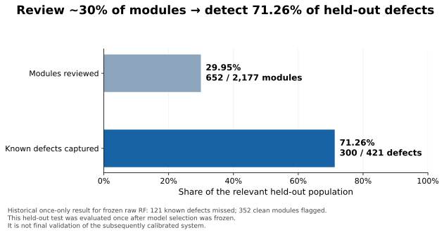
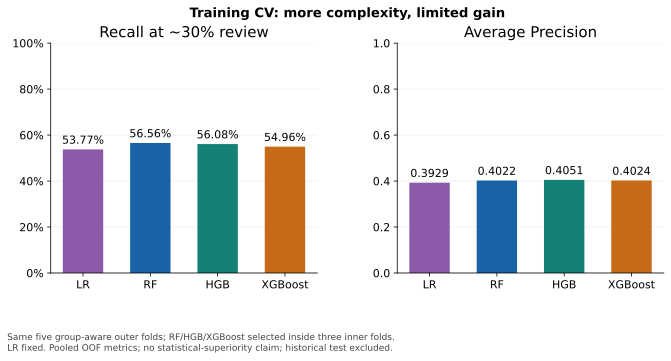

# DefectRisk: an ML engineering case for trustworthy review prioritization

The problem was not “identify every buggy function.” It was “with capacity to inspect about 30% of modules, how many recorded defects can we bring into that review queue?” That distinction changed the evaluation, model selection and final product claim.

**Historical raw RF result:** reviewing 652/2,177 modules captured 300/421 known defects (71.26% recall). This test was evaluated once after model selection was frozen. It is not a final validation of later calibration or abstention.

## Start with the failure modes

JM1 has 21 static code metrics and only ~19.35% defective labels. Predicting every module clean would yield ~80.65% accuracy while catching no defects. The baseline therefore reported defective precision, recall and F1, then shifted toward recall at a stated review capacity and Average Precision.

The first integrity audit found a more serious issue: the random train/test split shared **299 complete feature vectors**, and fit/validation shared **227**. There were 2,061 duplicate feature rows beyond the first, including 88 full-data groups with conflicting labels. Exact repeats could make validation partly measure recognition rather than generalization.

The fix grouped all original feature columns, excluded the target from group identity and allocated each group to one side of every evaluation boundary. Conflicting-label duplicates stayed together. No rows were removed. Deterministic 80/20 allocation approximated class balance; the same protection applied to validation and CV. Exact overlap audits became checks before model fitting.

## From a baseline to a product metric

The median-imputer → scaler → Logistic Regression pipeline provided a readable baseline. Unweighted LR recall was low; balancing class weights raised mean defective recall to **53.65%**, with precision **34.75%** and accuracy **71.55%**. This made the missed-defect versus wasted-review cost visible rather than hiding it inside accuracy.

Threshold experiments applied seven cutoffs to the **same OOF probabilities**, without refitting a different model per threshold. Lower cutoffs caught more defects and sent more clean modules to review. The actionable question became a capacity comparison: how well does each model rank modules when ~30% can be inspected?

Default Random Forest had higher accuracy but low defect recall at 0.50. Weighting did not solve that fixed-threshold problem. HGB and XGBoost were evaluated on the exact same group-aware folds, with class/sample weights computed only from fitting labels. A capacity comparison avoided treating one model's default probability scale as a universal operating policy.

## Controlled tuning and diminishing returns

Five outer group-aware folds estimated performance; three inner group-aware folds selected a small deterministic set of tree configurations by recall at ~30% review, with AP as a tie-breaker. Outer outcomes did not choose their own fold's parameters. The selected final RF configuration was frozen before the historical holdout was evaluated.

| Training OOF procedure | Recall at ~30% review | AP | Known defects flagged |
| --- | ---: | ---: | ---: |
| Balanced LR (fixed) | 53.77% | 0.3929 | 906/1,685 |
| Tuned weighted RF | 56.56% | 0.4022 | 953/1,685 |
| Tuned weighted HGB | 56.08% | 0.4051 | 945/1,685 |
| XGBoost (limited nested search) | 54.96% | 0.4024 | 926/1,685 |

RF caught 47 more defects than LR at the same workload. HGB's slightly better AP did not translate into more detections at the specified capacity. XGBoost caught 27 fewer defects than RF. It failed the prespecified materiality rule: +2 absolute recall points or +30 detections, without clearly worse AP.

The feature study audited skew, redundancy, target associations and `b` provenance. Interpretable density/ratio features, fitted log transforms and conservative pruning did not materially improve the result. Combined RF features caught 950 versus 953 original-feature defects; pruning added just one. The training partition contained 22 rows in 11 conflicting-label groups, so exact conflicts alone could not explain hundreds of misses.

A small ensemble check reused existing OOF scores without new fitting. RF/HGB averaging added **seven** detections: recall rose only **56.56% → 56.97%**. This was not material. The selected model remained the 200-tree, depth-8, weighted RF. Model-family exploration ended.

## Trustworthy probabilities are not certain decisions

Nested group-aware calibration selected sigmoid in every inner comparison. For the single frozen RF configuration, pooled Brier improved **0.18692 → 0.13863**, with AP roughly stable (~0.407 → ~0.406). This was better probability reliability, not a new ranking breakthrough. Calibration and confidence-policy selection never reused the historical final test.

The abstention experiment exposed the product boundary. A post-hoc ≥90%-precision tail contained four rows. Supported nested policy selection found no usable HIGH group; conservative automation left **98.44% UNCERTAIN**. Even 136 automatic LOW cases contained seven recorded defects. Forcing a label on every module would imply more confidence than the evidence warranted.

The implementation separates a probability model with version metadata from deterministic review/LOW/HIGH/UNCERTAIN policy and recommended action. No automatic defect-oracle claim is enabled. Calibration describes risk under the observed population; it is not causality, certainty or an out-of-distribution detector.

## Final interpretation and engineering deliverables

DefectRisk is a **leakage-safe risk-ranking system for human review prioritization**. The final artifact preserves all original features and the selected RF settings, fits sigmoid on group-held-out training scores, and records schema, dependencies, training fingerprints and SHA-256 checksums. Reproduction commands evaluate saved training-CV evidence; they never rerun the historical test.

Further algorithm complexity produced diminishing returns. The likely bottleneck became the information contained in static metrics, plus label ambiguity and snapshot quality. This is an evidence-based hypothesis, not proof that no possible model could improve. Repeated use of the same training data and a single historical dataset limit certainty about the conclusion.

The useful next investment is genuinely new prediction-time data: code churn, commit history, previous defects, ownership, change frequency, test coverage and review history, with explicit snapshot time and label horizon. A new independent external holdout is required for once-only validation of the calibrated/policy system. These are future data recommendations, not more model experiments.

Read the [model card](model-card.md), [calibration/uncertainty evidence](calibration-and-uncertainty.md), [nested tuning](tree-model-tuning.md), [feature study](feature-engineering.md), [final XGBoost challenge](final-model-challenge.md) and [ensemble plateau](ensemble-ranking.md). Machine-readable figure sources and their hashes are in [evidence.json](figures/evidence.json).
